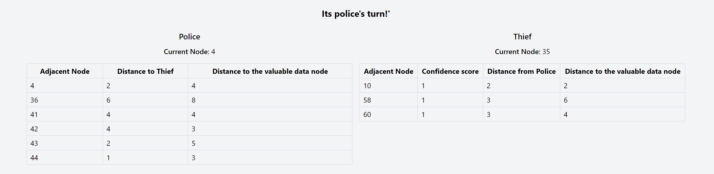
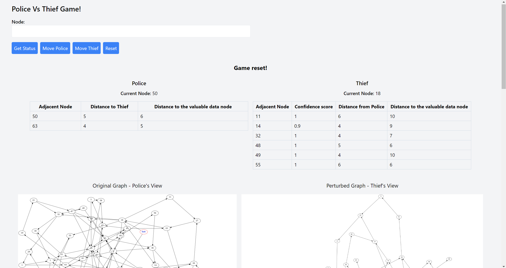

# I am

**Name :** Sarthak Agarwal

**UIN :** 679962604

**UIC email :** sagarw35@uic.edu

# Introduction

This project involves the creation of a microservice for the Police Thief game using the **Akka framework**. Additionally, a webpage is developed to interact with this API, utilizing **React.js**.

## Game Mechanics

- **Starting Point**: At the beginning of the game, both the police and the thief are positioned at random nodes.
- **Objectives**:
  - The police aim to capture the thief.
  - The thief tries to reach a graph node containing valuable data.
- **Gameplay**:
  - The turns alternate between the police and the thief.
  - Each player moves towards their target based on the information provided by the API.
  - If any player reaches a node without any outgoing edge they would lose (Exception: The police would not lose if they go to a terminal node with valuable data).
  - The thief must always move on to some different node while the police can stay in the same node.
- **Modified Graph for the Thief**:
  - To simulate traps set by the police, the thief sees a modified version of the graph.
  - Each node visible to the thief comes with a confidence(based on [SimRank](https://en.wikipedia.org/wiki/SimRank)) score indicating the likelihood of it not being a trap.
  - If the thief enters a trap, they lose the game.

## Implementation Details

- **Docker Images**: Docker images are created for both the backend program and the frontend web application.
- **Deployment**: The website is deployed on **AWS EC2**.
- **Automated Gameplay**:
  - An **HTTP client** program is developed to automatically play the game for several iterations.
  - Different strategies are employed for the police and the thief, with the program outputting consolidated results.

## Graph Generation

- The original graph (viewed by the police) and the perturbed graph (with traps, viewed by the thief) are generated using Professor Mark Grechanik's **[NetGameSim](https://github.com/0x1DOCD00D/NetGameSim)** program.
- For more information about Professor Grechanik, visit his [UIC profile](https://www.cs.uic.edu/~drmark/).

## Directory structure

```
root/
├─ ServerPrograms/
│  ├─ PoliceThiefGame/
│  └─ PoliceThiefGameFrontend/
│
├─ ClientProgram/
│   └─ PoliceThiefGameClient/
│
└─ docker-compose.yml
│
└─ ReadmeImages/
```

# Game Service

The **Akka backend** of our game service offers several endpoints for clients to interact with and play the game. There are four main endpoints:

1. GET `/status`
2. GET `/reset`
3. POST `/move/police/{next_node}`
4. POST `/move/thief/{next_node}`

All these endpoints return data in a JSON format, serialized from the following Scala case class:

```scala
case class Response(
    message: String,
    data: (
        ((String, Int), Map[Int, (Int, Int)]),
        ((String, Int), Map[Int, (Double, Int, Int)])
    )
)
```

## Endpoint Details

- **Message**: Each response includes a message that describes the current state of the game.
- **Data**: The data part of the response provides information about:
  - The current nodes of the Police and the Thief.
  - The nodes connected to the Police and the Thief.
  - For the Police: The data map's key is the node with an outgoing edge from the current node. The tuple values are the distances to the current Thief node and the valuable node.
  - For the Thief: The data map's key is the node with an outgoing edge from the current node. The tuple values are the confidence score (probability that the node is not a trap), distance from the Police, and distance to the valuable node.

### Specific Functions of the Endpoints

- **`/status`**: Provides current game state information.
- **`/reset`**: Resets the game by placing the Police and the Thief at distinct random nodes.
- **`/move` endpoints**: Allow moving the Police and the Thief to a valid node when it's their turn.

**Sample response on the webpage:**


**Sample response in JSON:**

```JSON
{
  "message": "Its police's turn!'",
  "data": [
    [
      [
        "Police",
        4
      ],
      {
        "4": [
          2,
          4
        ],
        "36": [
          6,
          8
        ],
        "41": [
          4,
          4
        ],
        "42": [
          4,
          3
        ],
        "43": [
          2,
          5
        ],
        "44": [
          1,
          3
        ]
      }
    ],
    [
      [
        "Thief",
        35
      ],
      {
        "10": [
          1,
          2,
          2
        ],
        "58": [
          1,
          3,
          6
        ],
        "60": [
          1,
          3,
          4
        ]
      }
    ]
  ]
}
```

# Automatic HTTP Client

An HTTP client is implemented to automatically play the game for a number of iterations, as specified in the configuration file, using different combinations of strategies.

## Strategies

### Police Strategies

- **Police Naive**: Chooses the node with the least distance to the thief.
- **Police Smart**: Selects the node closest to the valuable node and waits for the thief.

### Thief Strategies

- **Thief Naive**: Moves towards the node with the least distance to the valuable node.
- **Thief Smart**: Prefers the node with the least distance to the valuable node, but only if it has a similarity rank confidence score above a certain threshold (specified in the config). If all available nodes have a lower confidence score than the threshold, the thief chooses the node with the highest score.

For each combination of police and thief strategies, the client plays the game for the specified number of iterations. It then saves the consolidated results for different strategy combinations in a YAML file. A sample YAML file is provided for reference.

# Deployment on AWS EC2 using Docker

## Building docker images

The docker files used to create the images are given below:

```Dockerfile
FROM openjdk:8-jdk-alpine

WORKDIR /app

COPY PoliceThiefGame-assembly-0.1.0-SNAPSHOT.jar /app/PoliceThiefGame-assembly-0.1.0-SNAPSHOT.jar
COPY original_graph.json /app/original_graph.json
COPY perturbed_graph.json /app/perturbed_graph.json

EXPOSE 8080

CMD ["java", "-jar", "/app/PoliceThiefGame-assembly-0.1.0-SNAPSHOT.jar", "/app/original_graph.json", "/app/perturbed_graph.json"]
```

```Dockerfile
FROM node:alpine

WORKDIR /app

COPY package*.json ./

RUN npm install

COPY . .

RUN npm run build

CMD ["npm", "start"]
```

## Running on AWS EC2 Using Docker Images

The Docker images for the project have been pushed to my DockerHub repository. To run the application on an AWS EC2 instance, follow these steps:

1. **Create and SSH into EC2 Instance**:

   - Create an EC2 instance.
   - SSH into the instance using: `ssh -i {path_to_ssh_key} ec2-user@{ec2_ip}`.
   - Add an inbound rule for port 8080 with Anywhere-IPv4 in the EC2 security group.

2. **Set Up `docker-compose.yml`**:

   - Create a `docker-compose.yml` file on the EC2 instance.
   - Insert the following content into the file:

   ```YAML
   version: "3.8"
   services:
     backend:
       image: saartank/uic-cs-441-hw-3-backend
       ports:
         - "8080:8080"
       networks:
         - webnet

     frontend:
       image: saartank/uic-cs-441-hw-3-frontend
       environment:
         - NEXT_PUBLIC_BACKEND_URL=http://backend:8080
       ports:
         - "3000:3000"
       depends_on:
         - backend
       networks:
         - webnet

     nginx:
       image: nginx:latest
       ports:
         - "80:80"
       volumes:
         - ./default.conf:/etc/nginx/conf.d/default.conf:ro
       depends_on:
         - frontend
       networks:
         - webnet

   networks:
     webnet:

   ```

3. **Create `default.conf`:**

- Make another file in the same directory named `default.conf`.
- Add the following contents to `default.conf`, replacing `{ec2_ip}` with your EC2 instance's IP address:

```
server {
    listen 80;
    server_name {ec2_ip};

    location / {
        proxy_pass http://frontend:3000;
        proxy_http_version 1.1;
        proxy_set_header Upgrade $http_upgrade;
        proxy_set_header Connection 'upgrade';
        proxy_set_header Host $host;
        proxy_cache_bypass $http_upgrade;
        proxy_set_header X-Forwarded-For $proxy_add_x_forwarded_for;
        proxy_set_header X-Forwarded-Proto $scheme;
    }
}
```

4. **Install docker and docker-compose:**

   - **Install Docker**:
     Run the following commands to install Docker:

     ```
     sudo yum install docker -y
     sudo service docker start
     ```

   - **Install Docker Compose**:
     Run the following commands to install Docker Compose:
     ```
     sudo curl -L "https://github.com/docker/compose/releases/download/1.29.2/docker-compose-$(uname -s)-$(uname -m)" -o /usr/local/bin/docker-compose
     sudo chmod +x /usr/local/bin/docker-compose
     sudo yum install libxcrypt-compat -y
     ```

5. **Run docker-compose:**
   Finally, login into docker account and run Docker Compose using the `docker-compose.yml` file by executing the following command:
   ```
   sudo docker-compose up
   ```

Docker Compose will pull the Docker images for the backend and frontend from my repository. It will also pull the image for NGINX. Then, it runs all three containers. Once the startup finishes, navigate to the EC2 public URL to use the web app.

**The webpage would look like:**



# Video Demo
